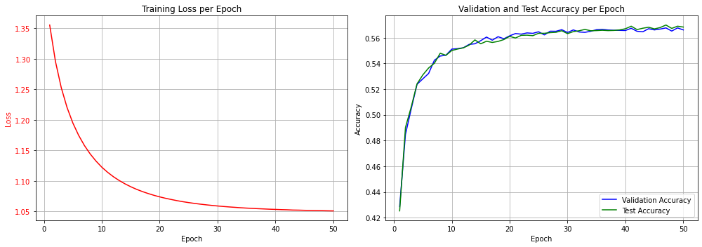

# Practical Word Embeddings: From Training to Application with PyTorch 🚀

[](https://www.python.org/)
[](https://pytorch.org/)
[](https://radimrehurek.com/gensim/)

A hands-on repository demonstrating word embeddings, featuring Word2Vec training with Gensim and text classification using pre-trained GloVe vectors in PyTorch on the AG News dataset.

## 🎯 Project Overview

Word embeddings are a cornerstone of modern Natural Language Processing (NLP). They represent words as dense vectors, capturing semantic relationships in a way that machine learning models can understand. This project provides a practical, two-part exploration of word embeddings:

1.  **Training from Scratch:** We build a `Word2Vec` model on a small custom corpus using the `gensim` library to understand the fundamentals of how these embeddings are created.
2.  **Applying Pre-trained Embeddings:** We leverage the power of pre-trained `GloVe` embeddings for a real-world downstream task: text classification. We build a PyTorch model to classify news articles into categories, demonstrating the power of transfer learning in NLP.

This repository is designed to be a clear, educational resource for anyone looking to bridge the gap between the theory of word embeddings and their practical implementation.

## 📂 Repository Structure

```bash
Practical-Word-Embeddings-PyTorch/
├── ag_news/
│   ├── test.parquet
│   └── train.parquet
├── images/
│   └── train_loss-val_test_acc_epochs.png
├── 01_Word2Vec_Training_with_Gensim.ipynb
├── 02_GloVe_for_Text_Classification.ipynb
├── my_model.pth
└── README.md

```

---


## 📖 Notebooks Breakdown

### 1. `01_Word2Vec_Training_with_Gensim.ipynb`

This notebook serves as a gentle introduction to creating word embeddings from the ground up.

**Key Steps:**
* Defines a small, sample corpus of sentences.
* Uses `gensim.models.Word2Vec` to train a custom word embedding model.
* Explores the resulting vector space by finding most similar words and measuring semantic similarity between word pairs (e.g., `similarity("pizza", "pasta")`).
* Demonstrates how to wrap these trained embeddings in a `torch.nn.Embedding` layer for use in PyTorch models.

### 2. `02_GloVe_for_Text_Classification.ipynb`

This notebook showcases a more common and powerful use case: applying large-scale, pre-trained embeddings to a downstream task.

**Key Steps:**
* **Data Loading:** Loads the AG News dataset using `pandas`.
* **Embedding Preparation:** Loads the 100-dimensional GloVe embeddings (`glove.6B.100d.txt`).
* **Vocabulary & DataLoaders:** Builds a vocabulary from the GloVe embeddings and creates efficient `DataLoader` instances for training, validation, and testing using `torchtext`.
* **Model Architecture:** Defines a simple `TextClassificationModel` in PyTorch that uses an `nn.EmbeddingBag` (or averaged embeddings) followed by a linear layer. The embedding layer is initialized with the GloVe vectors and is frozen to leverage the pre-trained knowledge.
* **Training & Evaluation:** Trains the model for 50 epochs, tracks loss and accuracy, and saves the best-performing model.
* **Results Visualization:** Plots the training loss and validation/test accuracy curves over epochs.

---

## 📈 Results

The text classification model trained on the **AG News** dataset achieves a final **test accuracy of ~56.8%**.  
The training process and performance are visualized below:



This result serves as a strong **baseline**, demonstrating the effectiveness of using **pre-trained embeddings** even with a simple linear model.  
